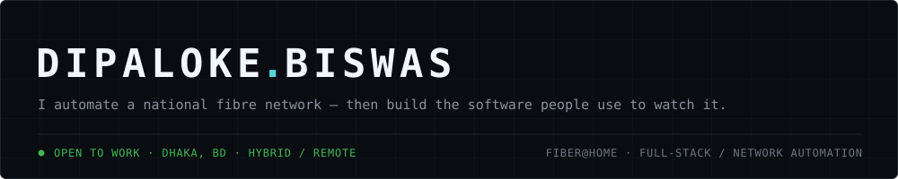
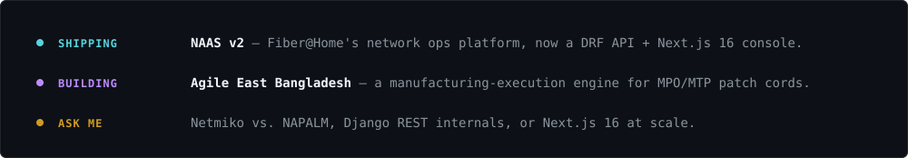
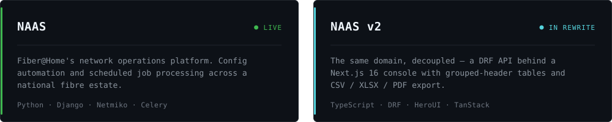
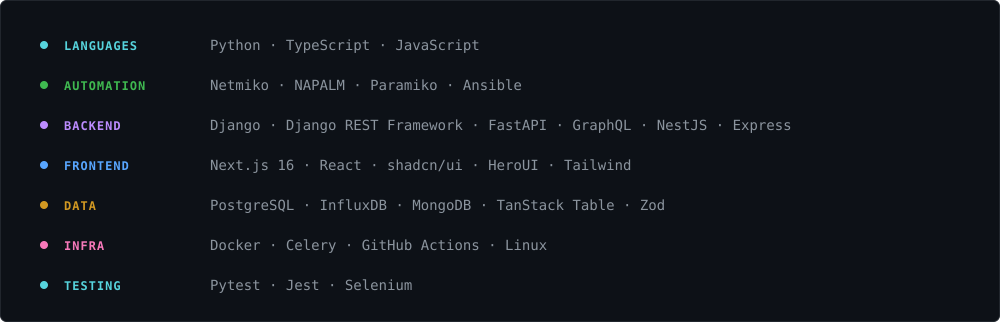
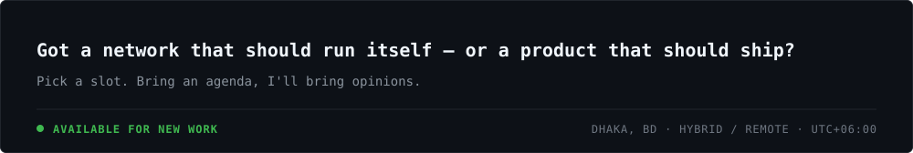

<!-- ============================================================
     dipaloke/dipaloke — profile README
     Design: "Control Plane" — each category owns one hue, reused
     wherever that category appears so colour carries meaning.

     The SVG panels in assets/ are GENERATED. Edit the content
     constants in scripts/build_assets.py and re-run it; do not
     hand-edit the .svg files. The script width-checks every line
     and fails the build on overflow.

     Panels are images and never reflow, so dense reference content
     (track record, credentials, project table) stays as markdown +
     badges on purpose — that keeps it readable on a phone.
     ============================================================ -->

<picture>
  <source media="(prefers-color-scheme: dark)" srcset="assets/banner-dark.svg">
  <source media="(prefers-color-scheme: light)" srcset="assets/banner-light.svg">
  
</picture>

<picture>
  <source media="(prefers-color-scheme: dark)" srcset="https://readme-typing-svg.demolab.com?font=JetBrains+Mono&weight=600&size=19&duration=2800&pause=900&color=56D4DD&background=00000000&vCenter=true&width=620&height=44&lines=%3E+network+automation+engineer;%3E+full-stack+developer;%3E+django+%C2%B7+drf+%C2%B7+fastapi+%C2%B7+graphql;%3E+next.js+16+%C2%B7+react+%C2%B7+shadcn%2Fui">
  <source media="(prefers-color-scheme: light)" srcset="https://readme-typing-svg.demolab.com?font=JetBrains+Mono&weight=600&size=19&duration=2800&pause=900&color=0F7F8C&background=00000000&vCenter=true&width=620&height=44&lines=%3E+network+automation+engineer;%3E+full-stack+developer;%3E+django+%C2%B7+drf+%C2%B7+fastapi+%C2%B7+graphql;%3E+next.js+16+%C2%B7+react+%C2%B7+shadcn%2Fui">
  
</picture>

[](https://dipaloke-portfolio.vercel.app/)
[](https://www.linkedin.com/in/dipaloke-biswas-72681a10a/)
[](mailto:dipalokebiswas@proton.me)
[](https://calendly.com/dipalokebiswas96/30min)

## Now

<picture>
  <source media="(prefers-color-scheme: dark)" srcset="assets/now-dark.svg">
  <source media="(prefers-color-scheme: light)" srcset="assets/now-light.svg">
  
</picture>

## Work

<picture>
  <source media="(prefers-color-scheme: dark)" srcset="assets/work-dark.svg">
  <source media="(prefers-color-scheme: light)" srcset="assets/work-light.svg">
  
</picture>

<div align="center">

[](https://github.com/dipaloke/case-notes/blob/main/naas.md)
[](https://github.com/dipaloke/case-notes/blob/main/naas-v2.md)

</div>

> [!NOTE]
> **Why the source is private.** Most of what I build is company-owned, and the deployments sit inside a corporate network. Every link here is a public write-up instead — what it does, how it's built, and the decisions that mattered. No proprietary code.

<details>
<summary><b>&nbsp;Four more projects</b> &nbsp;—&nbsp; commerce, a customer portal, a CMS, and one you can read the source of</summary>

<br>

| Project | What it does | |
|:---|:---|:---|
| **Agile East Bangladesh** | Patch-cord commerce with a manufacturing brain — validates polarity, fire-safety and stock before it lets you check out. <br><br>     | [](https://github.com/dipaloke/case-notes/blob/main/agile-east-bangladesh.md) |
| **Bandwidth Graph Portal** <br>  | Customer-facing bandwidth utilisation portal for Fiber@Home subscribers. Shipped to production and in daily use. <br><br>     | [](https://github.com/dipaloke/case-notes/blob/main/bandwidth-graph.md) |
| **WEEE Society** | Public site and a custom CMS for Bangladesh's e-waste recycling and advocacy society. Docker from dev to prod. <br><br>    | [](https://github.com/dipaloke/case-notes/blob/main/weee-society.md) |
| **Collectify** <br>  | Custom-field collection manager: typed collections, item CRUD, auth, image uploads and a Jira-backed issue reporter. <br><br>     | [](https://github.com/dipaloke/collectify) |

</details>

## Stack

<picture>
  <source media="(prefers-color-scheme: dark)" srcset="assets/stack-dark.svg">
  <source media="(prefers-color-scheme: light)" srcset="assets/stack-light.svg">
  
</picture>

<details>
<summary><b>&nbsp;Track record</b> &nbsp;—&nbsp; Fiber@Home, Itransition Group, XPONENT InfoSystem, B.Sc. CS</summary>

<br>

| When | Where | What |
|:---|:---|:---|
|  | **Full Stack Developer &<br>Network Automation Engineer** <br> Fiber@Home Ltd. | NAAS on Django, now modernising to DRF + Next.js 16. Shipped the Bandwidth Graph customer portal to production. |
|  | **Intern Developer** <br> Itransition Group | Enterprise SaaS UIs in React, remote from the US. Cut re-renders 25% with memoisation. |
|  | **Junior Web Developer** <br> XPONENT InfoSystem | 3+ interactive React/Next.js dashboards, +40% client engagement, 95 Lighthouse a11y. |
|  | **B.Sc. Computer Science** <br> North University of China | English-taught programme in Shanxi, China. Graduated 3.4. |

</details>

<details>
<summary><b>&nbsp;Credentials</b> &nbsp;—&nbsp; 15 certifications, most recent first</summary>

<br>

| When | Certification | Issuer |
|:---|:---|:---|
| `JUL 2026` | AI Fluency: Framework & Foundations |  |
| `MAY 2026` | Data Science Foundations L1 |  |
| `MAY 2026` | Claude Code 101 |  |
| `FEB 2026` | Ultimate Django Series, Pt. 1 & 2 |  |
| `JUN 2025` | Node, Express & MongoDB Bootcamp |  |
| `MAY 2024` | CI Workflows with GitHub Actions |  |

[](https://www.linkedin.com/in/dipaloke-biswas-72681a10a/details/certifications/)

</details>

## Telemetry

<table width="100%">
<tr>
<td width="50%" align="center"></td>
<td width="50%" align="center"></td>
</tr>
</table>

<div align="center">

</div>

<details>
<summary><b>&nbsp;Coding-time breakdown</b> &nbsp;—&nbsp; updated every 12 hours by GitHub Actions</summary>

<!--START_SECTION:waka-->


**🐱 My GitHub Data** 

> 📦 ? Used in GitHub's Storage 
 > 
> 🏆 1,706 Contributions in the Year 2026
 > 
> 💼 Opted to Hire
 > 
> 📜 71 Public Repositories 
 > 
> 🔑 0 Private Repositories 
 > 
**I'm an Early 🐤** 

```text
🌞 Morning                1055 commits        ████░░░░░░░░░░░░░░░░░░░░░   14.38 % 
🌆 Daytime                3659 commits        ████████████░░░░░░░░░░░░░   49.86 % 
🌃 Evening                2149 commits        ███████░░░░░░░░░░░░░░░░░░   29.28 % 
🌙 Night                  476 commits         ██░░░░░░░░░░░░░░░░░░░░░░░   06.49 % 
```
📅 **I'm Most Productive on Sunday** 

```text
Monday                   1485 commits        █████░░░░░░░░░░░░░░░░░░░░   20.23 % 
Tuesday                  1314 commits        ████░░░░░░░░░░░░░░░░░░░░░   17.90 % 
Wednesday                1395 commits        █████░░░░░░░░░░░░░░░░░░░░   19.01 % 
Thursday                 766 commits         ███░░░░░░░░░░░░░░░░░░░░░░   10.44 % 
Friday                   320 commits         █░░░░░░░░░░░░░░░░░░░░░░░░   04.36 % 
Saturday                 318 commits         █░░░░░░░░░░░░░░░░░░░░░░░░   04.33 % 
Sunday                   1741 commits        ██████░░░░░░░░░░░░░░░░░░░   23.72 % 
```


📊 **This Week I Spent My Time On** 

```text
🕑︎ Time Zone: Asia/Dhaka

💬 Programming Languages: 
Other                    7 hrs 39 mins       ███████████░░░░░░░░░░░░░░   44.38 % 
Markdown                 3 hrs 24 mins       █████░░░░░░░░░░░░░░░░░░░░   19.70 % 
Python                   3 hrs 7 mins        █████░░░░░░░░░░░░░░░░░░░░   18.09 % 
Text                     1 hr 26 mins        ██░░░░░░░░░░░░░░░░░░░░░░░   08.38 % 
HTML                     38 mins             █░░░░░░░░░░░░░░░░░░░░░░░░   03.76 % 

🔥 Editors: 
Claude Code              10 hrs 36 mins      ███████████████░░░░░░░░░░   61.46 % 
OpenClaw                 2 hrs 44 mins       ████░░░░░░░░░░░░░░░░░░░░░   15.89 % 
Chrome                   2 hrs 1 min         ███░░░░░░░░░░░░░░░░░░░░░░   11.75 % 
Antigravity              1 hr 46 mins        ███░░░░░░░░░░░░░░░░░░░░░░   10.32 % 
VS Code                  6 mins              ░░░░░░░░░░░░░░░░░░░░░░░░░   00.58 % 

💻 Operating System: 
Linux                    15 hrs 31 mins      ██████████████████████░░░   89.95 % 
Windows                  1 hr 44 mins        ███░░░░░░░░░░░░░░░░░░░░░░   10.05 % 
```

**I Mostly Code in JavaScript** 

```text
JavaScript               29 repos            ██████████░░░░░░░░░░░░░░░   39.73 % 
TypeScript               21 repos            ███████░░░░░░░░░░░░░░░░░░   28.77 % 
HTML                     10 repos            ███░░░░░░░░░░░░░░░░░░░░░░   13.70 % 
Python                   9 repos             ███░░░░░░░░░░░░░░░░░░░░░░   12.33 % 
Java                     2 repos             █░░░░░░░░░░░░░░░░░░░░░░░░   02.74 % 
```


 Last Updated on 03/09/2026 15:47:40 UTC
<!--END_SECTION:waka-->

</details>

## Talk to me

<picture>
  <source media="(prefers-color-scheme: dark)" srcset="assets/footer-dark.svg">
  <source media="(prefers-color-scheme: light)" srcset="assets/footer-light.svg">
  
</picture>

<div align="center">

[](https://calendly.com/dipalokebiswas96/30min)
[](mailto:dipalokebiswas@proton.me)
[](https://dipaloke-portfolio.vercel.app/)

</div>
